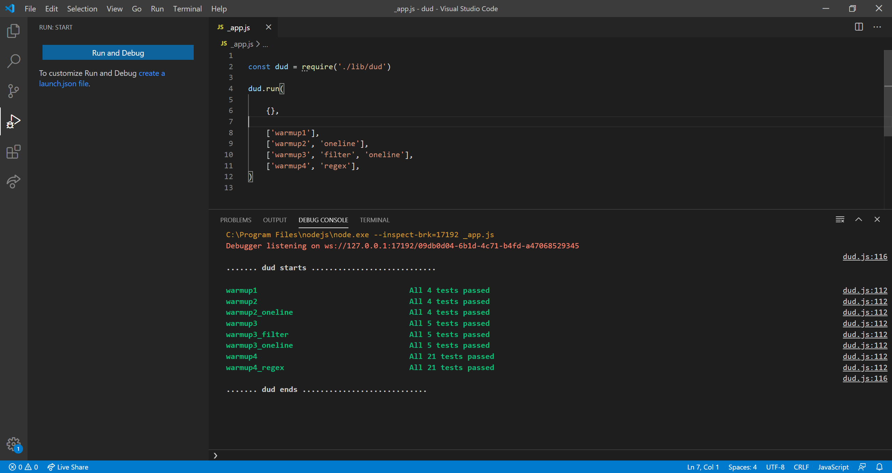

# dud.js

Experimental JavaScript testing library.

With this testing library you can comment your functions with simple test cases. When *dud.js* is executet it will run your tests from the comments.

A side effect is that the test cases usually gives you a pretty good documentation of the function (instead of writing long comments)

Here's an example of a function with four tests.

    /*
    5, true     ➞ "*6*"
    20, true    ➞ "*21*"
    10, false   ➞ "11"
    15, false   ➞ "16"
    */

    function warmup2(a, b) {
        if (b)
            return `*${a + 1}*`
        else
            return `${a + 1}`
    }

Here's a screenshot where *_app.js* is run from Visual Studio Code:

# Join me 

Interested in developing this idea in JavaScript or another language like C#?

Send a mail to oo@happybits.se

Oscar